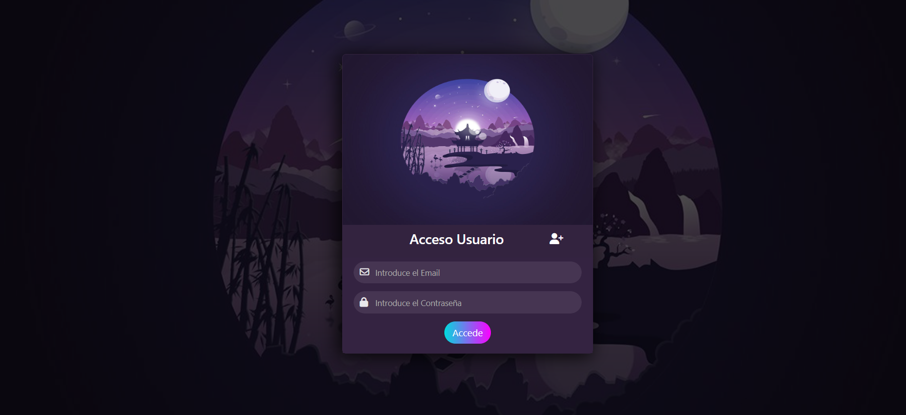

# GOrenesTest

## Tabla de Contenidos

- [Formulario de Login](#formulario-de-login)
  - [Descripción del Ejercicio](#descripción-del-ejercicio)
  - [Implementación](#implementación)
  - [Entrega del Proyecto](#entrega-del-proyecto)
- [Instalación](#instalación)
- [Uso](#uso)
- [Tecnologías Utilizadas](#tecnologías-utilizadas)
- [Contribución](#contribución)
- [Autor](#autor)

## Formulario de Login

Este proyecto consiste en la creación de un formulario de login donde los usuarios puedan ingresar con su nombre de usuario y contraseña.

### Descripción del Ejercicio

El objetivo es demostrar habilidades técnicas y otras características relevantes a través de esta funcionalidad. El formulario debe ser capaz de manejar tanto inicios de sesión correctos como incorrectos.

### Implementación

Se recomienda utilizar Angular para la implementación del formulario. Se puede profundizar en la implementación utilizando diferentes fuentes de datos para los usuarios.

### Entrega del Proyecto

El producto final debe ser el acceso a un repositorio git público o privado que hayas creado. [Repositorio del Proyecto](https://github.com/MarinaDevops4/GOrenesTest)

## Instalación

1. **Instalar Node.js:** Descarga e instala Node.js desde [https://nodejs.org/](https://nodejs.org/).
2. **Instalar MongoDB:** Sigue las instrucciones para tu sistema operativo desde [https://docs.mongodb.com/manual/installation/](https://docs.mongodb.com/manual/installation/).
3. **Clonar el Repositorio:** Ejecuta `git clone https://github.com/MarinaDevops4/GOrenesTest.git` en tu terminal.
4. **Instalar Dependencias del Servidor:** Navega hasta el directorio del servidor (`cd GOrenesTest/server`) y ejecuta `npm install`.
5. **Configurar MongoDB:** Asegúrate de que MongoDB esté configurado y en ejecución en tu sistema local.
6. **Ejecutar el Servidor:** Ejecuta `npm run dev` en el directorio del servidor.
7. **Instalar Dependencias del Cliente:** Navega hasta el directorio del cliente (`cd ../client`) y ejecuta `npm install`.
8. **Ejecutar la Aplicación Cliente:** Ejecuta `ng serve` en el directorio del cliente.

## Uso

Una vez que la aplicación está instalada y en funcionamiento, sigue estos pasos para usarla:

- **Registro de Usuario:** Crea una cuenta si no tienes ya cuenta creada.
- **Inicio de Sesión:** Inicia sesión con tus credenciales de usuario.
- **Explorar Funcionalidades:** ¿Conoces Angular? Espero que sí y si no siempre hay solución.
- **Interactuar con la Interfaz de Usuario:** Utiliza la interfaz de usuario para realizar acciones específicas.
- **Cerrar Sesión:** Cierra sesión para proteger tu cuenta y datos personales.

## Tecnologías Utilizadas

- **Angular:** : v17.3.5 [Documentación de Angular](https://angular.io/docs)
- **HTML:** [Documentación de HTML (MDN Web Docs)](https://developer.mozilla.org/en-US/docs/Web/HTML)
- **CSS:** [Documentación de CSS (MDN Web Docs)](https://developer.mozilla.org/en-US/docs/Web/CSS)
- **JavaScript/TypeScript:** 
  - [Documentación de JavaScript (MDN Web Docs)](https://developer.mozilla.org/en-US/docs/Web/JavaScript)
  - [Documentación de TypeScript](https://www.typescriptlang.org/docs/)
- **Node.js:** : v18.18.2 [Documentación de Node.js](https://nodejs.org/docs/latest-v16.x/api/)
- **MongoDB:** : v7.0.2 [Documentación de MongoDB](https://docs.mongodb.com/)
- **Express:** : 4.19.2 [Documentación de Express](https://expressjs.com/en/4x/api.html)

## Contribución

¡Toda contribución es bienvenida!

## Autor

[Marina Barceló Gómez]
